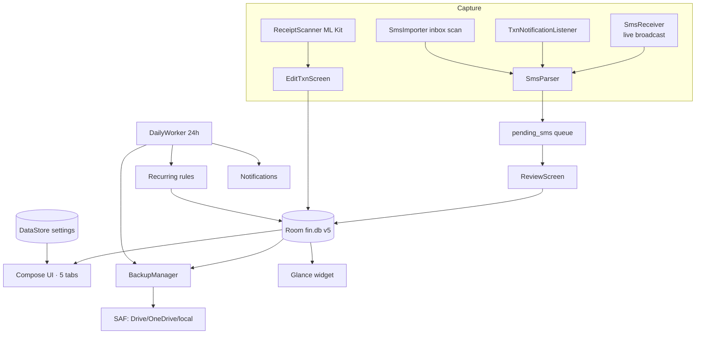
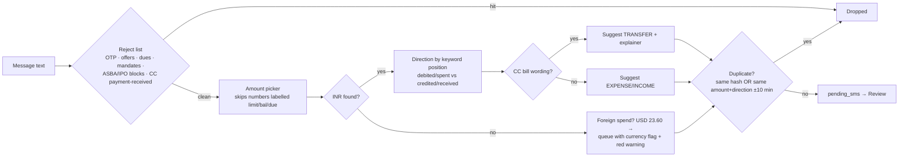
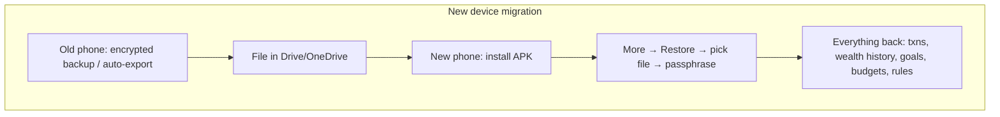

# Kosh — Design Document

Kosh (कोश, "treasury") is a **privacy-first, local-first personal finance app for Android**: money in/out, budgets, goals, event funds, recurring transactions, net-worth tracking, insights, and encrypted backups — with no server and no INTERNET permission. This document covers every module, its flows, and the reasoning behind decisions.

---

## 1. Core principles

1. **No server, ever.** All data lives in a Room/SQLite DB in app-private storage. The APK ships **without the INTERNET permission** (stripped via `tools:node="remove"` even when libraries request it).
2. **User approves everything.** No detected transaction is recorded without an explicit tap; automation only produces *suggestions*.
3. **Encrypted before it leaves.** Every file that exits the app is AES-256-GCM encrypted with a user passphrase. CSV export is the single plaintext exception, by explicit user action.
4. **Deterministic intelligence.** Search, digests, categorization, and baselines are rule-based and explainable. On-device ML (OCR today, Gemini Nano later) is opt-in and additive.
5. **Progressive enhancement.** No SMS permission → notification capture; no biometrics → never locked out; no prior data → smart features stay hidden instead of guessing.

## 2. System architecture

- Single module; **manual DI in `FinApp`** (database, repository, settings, backupManager, smsImporter). No DI framework.
- **One shared `AppViewModel`** (StateFlows per table + all actions); screens are thin.
- `FinRepository` is the only gateway to DAOs. Money is always **`Long` minor units (paise)**.

## 3. Data model (Room v5)

| Table | Purpose | Notable fields / invariants |
|---|---|---|
| `categories` | 20 seeded defaults + custom | `kind` = EXPENSE or INCOME; emoji + color; defaults deletable |
| `transactions` | Every money event | `type` EXPENSE/INCOME/**TRANSFER**; `source` MANUAL/SMS/RECURRING/IMPORT; `accountTail`; `smsHash` (dedupe); `eventBudgetId` (expense→event), `goalId` (income→goal) |
| `pending_sms` | Awaiting approval | unique `smsHash`; `status` PENDING/REJECTED (rejected kept to block re-offers, pruned later); `foreignCurrency` flag |
| `budgets` | Monthly cap per category | `categoryId` PK — one budget per category |
| `assets` | Holdings & liabilities | `type` (14 kinds), `isLiability`, `investedMinor` (0 = returns not tracked), `platform` free text |
| `asset_values` | Full value history | append-only; latest-at-time queries power all trends |
| `goals` | Savings targets | `targetMinor`, optional `deadlineMillis` |
| `goal_contributions` | Manual additions to a goal | plus income tagged via `transactions.goalId` |
| `event_budgets` | One-off funds (trip, wedding) | `plannedMinor`; expenses tag via `transactions.eventBudgetId` |
| `recurring_rules` | Monthly auto-posts | `dayOfMonth` 1–28, `lastAppliedKey` "yyyy-MM" for idempotent back-fill |

Migrations: v1→2 wealth · v2→3 events + txn tags · v3→4 recurring · v4→5 `foreignCurrency`.

**Deletion semantics:** deleting a category leaves transactions uncategorized; deleting an event budget/goal keeps transactions, just untagged; deleting an asset removes its value history (confirmed dialog).

## 4. Module deep dives

### 4.1 Home

- **Hero month card**: `HorizontalPager` across every month from the earliest transaction to now (max 120), chevrons + swipe; re-anchors to the current month when data first loads. Shows net / income / expenses for the visible month.
- **All time toggle** swaps the pager for a single since-inception card.
- **Quick actions** row: Goals, Wealth, Categories, Insights.
- **Pending banner** ("N transactions detected from SMS") → review queue; also mirrored as a badge on the Activity tab and a banner inside Activity.
- **Budgets snapshot**: top 3 budgets by usage for the *current* month (pinned regardless of pager page), progress bars, overspend in red.
- **Personal baseline line**: "You usually spend ~₹X by day N — this month ₹Y, Z% ahead/below/on pace." Average of the previous 3 months truncated at today's day-of-month; hidden until at least one prior month has expenses; ±15% band reads as "on pace".
- **Recent**: last 8 transactions; "See all" → Activity.

### 4.2 Capture pipeline (SMS + notifications)

- **Sources**: live `SmsReceiver` (system-only broadcast) · inbox scan (1/3/12 months, from More) · `TxnNotificationListener` (Play-compatible; sees bank-app *and* messaging-app notifications; cannot read history; both paths can run together — the 10-minute dedupe absorbs the overlap).
- **Merchant extraction** order: `at/to X` · `from X` · `VPA x@y` · bare UPI id after to/at · `Info:` · card format "on DATE on MERCHANT". Title-cased; VPAs kept lowercase.
- **Category suggestion**: user's own last category for that merchant (learning) → keyword table → uncategorized.
- **Auto-capture toggle** (default on) gates the live receiver and listener; scanning is always explicit.

### 4.3 Review queue

Each card: sender, timestamp, amount, full message body (expandable), suggestion line, then **Approve / Edit / Reject**. Edit exposes a 3-way Expense/Income/Transfer selector, amount (formula-capable), merchant, and category chips filtered by type.

- **Foreign-currency warning** (red): amount shows the foreign value; user corrects to INR before approving.
- **CC-bill explainer** (red): why it's suggested as a Transfer, with all three options spelled out.
- **Approve all suggested (N)**: bulk button when ≥2 items have a confident suggestion (category learned/keyword-matched, or transfer); foreign-currency items excluded.
- Reject keeps the hash so the same message is never re-offered; rejected rows are pruned periodically.

### 4.4 Manual entry & editing (EditTxnScreen)

- 3-way type selector; transfers hide category/tags and show an explainer.
- **Amount accepts arithmetic** — `250+50*3`, `(1200-200)/2`, `1.5x1000`, `÷` — evaluated by a recursive-descent parser in `Format.parseAmount` (used by *every* amount field in the app: budgets, goals, wealth, recurring, review, split); main fields echo "= ₹400" live.
- **Habit prefill chip** (new transactions only): most frequent (merchant, amount) within ±90 min of now, 3+ occurrences in 60 days — one tap fills amount/merchant/type/category.
- **Receipt scan** (new transactions): photo picker → ML Kit OCR → total (prefers grand-total/payable lines, else the largest plausible number) + merchant (top clean line) prefilled.
- **Tagging**: expenses can tag one event budget; income can tag one goal (chips appear per type).
- **Split**: divide an expense across categories; running "adds up ✓" validation; produces sibling transactions and deletes the original.
- Date+time picker; delete with confirmation.

### 4.5 Activity (history + search)

- **Natural-language search** (`QueryParser`, deterministic):
  - *Amounts*: `20K`, `1.5L`, `2cr`, `20,000`, `of 500`, `above 10K`, `under 2000`
  - *Periods*: `today`, `yesterday`, `this/last week|month|year`, `Q2 last year`, `Q3 2025`, month names (bare future month → last year's), bare years
  - *Direction*: paid/spent/debited → expense; received/credited → income; transfer
  - Remaining words match merchant+note+category, **plural-insensitive**; learned **term→merchant synonyms** widen matches (recorded when a user opens a result that lacked the word; capped at 200 pairs).
  - Structured constraints are strict; text matching falls back to **ranked closest matches** (≥half the words) with a "showing closest matches" hint. An interpretation echo ("Searching: Q2 2025 · ₹20,000 · expense") always shows what was understood.
- Filter chips: type ×3 + every category. Day grouping with **transfer-neutral daily nets**. Rows: category emoji avatar (🔁 neutral for transfers), merchant, category · account tail, signed amount.

### 4.6 Insights

**Overview tab** — period chips Day/Week/Month/Year with prev/next arrows:
- Income & expense summary cards.
- **"In short" digest** (template sentences over exact aggregates): spend vs previous period %, biggest category with share, largest expense with merchant, savings rate / overspend warning.
- **Breakdown** donut per category, toggle Spend/Income.
- **Spending trend** bar chart bucketed by period.
- **Top merchants** (top 5 by spend with counts).
- **Likely subscriptions**: ≥3 charges, same merchant+amount, 25–35-day gaps → expected next charge date + **"Make recurring"** one-tap rule creation (hidden if a matching rule exists).
- **Quick stats**: average daily spend, biggest expense, savings rate.

**Compare tab** — MoM / QoQ / YoY: income/expense/net deltas with arrows, grouped bars, and **biggest category movers** (largest absolute change, both directions).

### 4.7 Budgets & Goals (three tabs)

- **Monthly**: one cap per expense category; progress bars; overspend highlighted; feeds Home snapshot and 80%/100% notifications. Set/edit/remove via dialog (formula amounts).
- **Events**: planned amount + emoji/name; spent = Σ tagged expenses; shows planned / spent / remaining with progress; deleting keeps expenses (untagged). Flow: create event → tag expenses from Edit screen → track.
- **Goals**: target + optional deadline; **saved = manual contributions + income tagged to the goal**; progress %, days left; contribution log with per-entry notes. Deleting keeps transactions.

### 4.8 Wealth (net worth)

- **Model**: manual ledger. 11 asset types (bank, FD/RD, MF, stocks, EPF/PPF/NPS, gold, crypto, property, cash, other) + 3 liability types (loan/EMI, credit-card due, other dues). Values are *snapshots in time*; every update appends to `asset_values`.
- **Add flow**: separate **+ Asset / − Liability** buttons → dialog with an "Asset · you own / Liability · you owe" selector, type chips filtered per side, name, platform/lender, current value (+ optional invested amount for assets).
- **Net worth** = Σ latest asset values − Σ latest liability values. Historical point-in-time = latest value per asset ≤ t (carry-forward), × sign.
- **Cards**: hero (net worth, assets vs liabilities) → **"In short" digest** (net-worth delta vs 30 days ago in ₹ and %, biggest single mover, liabilities as % of gross) → **trend** (6 month-end bars, carry-forward) → **Growth** (MoM/QoQ/YoY vs snapshots, filtered to periods that actually have history) → holdings list → liabilities list.
- **Per-holding returns** when invested amount is recorded: absolute + % gain, green/red.
- Tap a holding → same dialog to update value (new history point), edit metadata, or delete (confirms; removes history).
- **Stale-value nudges**: monthly notification listing holdings whose last update exceeds a volatility threshold — markets/accounts 35d, FD/EPF/gold 100d, property/other 370d.
- **Deliberate separation from cash flow**: income/expenses never auto-update assets — no double counting; the user updates their Bank/Cash asset when they choose. (Phase 2: on-device CAMS/KFintech CAS import to bulk-update MF/stock values.)

### 4.9 Recurring transactions

Rule = amount, type, category, merchant, day-of-month (1–28 to dodge short months), start date. Application is **idempotent back-fill**: on app start and daily worker, every month key from `lastAppliedKey`+1 to now posts one transaction (source RECURRING) if its day has passed; `lastAppliedKey` advances. Created manually or one-tap from the subscription detector (which stamps the current month key so it doesn't double-post the charge that triggered it).

### 4.10 Transfers

First-class third type for self-moves (CC bill payments, account sweeps). Excluded from every income/expense stat, budget, digest, and comparison; shown 🔁-neutral in lists and day nets. Suggested automatically for CC-bill wording.

### 4.11 Notifications (opt-in) & widget

Channels: budget alerts · review reminders · monthly summary. All are marker-gated (DataStore set, capped 200) to fire once per period:
- Budget 80% and 100% per category per month.
- Review nudge: daily if the queue is non-empty.
- Month summary on the 1st: last month's income/spend/net.
- Stale wealth values: monthly (see 4.8).
Widget (Glance): current month net/income/expenses, tap to open; refreshed on every transaction change and daily.

### 4.12 Security & privacy

- **App lock**: BiometricPrompt (BIOMETRIC_WEAK | DEVICE_CREDENTIAL) on launch and whenever the app returns from background (ProcessLifecycleOwner); devices with no screen lock are never locked out; tri-state gate avoids the lock-screen flash on cold start.
- **Block screenshots** (default on): FLAG_SECURE hides content from screenshots, recordings, and Recents; toggle in More.
- Receiver/listener gated by system-only permissions; zero logging of message content; account numbers only ever stored as 3–6-digit tails.
- Deliberately **no SQLCipher**: Android FBE covers at-rest; a device-resident key adds failure modes without stopping a root-level attacker (full rationale in git history).

### 4.13 Backup, export & migration

| Mechanism | Trigger | Destination | Protection |
|---|---|---|---|
| Manual encrypted backup | user | any SAF target | AES-256-GCM · PBKDF2 200k · passphrase ≥8, never stored |
| **Scheduled auto-export** | weekly/monthly (DailyWorker + app start) | user-chosen folder (persisted SAF grant) | same crypto; passphrase stored app-private for unattended runs; dated files `kosh-auto-backup-DATE.finbak`; "Back up now" + "Turn off" in manage dialog; silent retry next day on failure |
| Android Auto Backup | OS ~daily (idle/Wi-Fi) | Google Drive app-data (hidden) | OS-managed, lockscreen-key; restores only at install, same account + signature |
| Device-to-device | new-phone setup | direct | OS-managed |
| CSV export | user | any | **plaintext, warned** |
| CSV import | user | transactions (`date,type,amount,category,merchant,note`; dupes skipped, unknown categories created) · holdings (`name,platform,type,invested,current`; matched by name) | — |

`.finbak` = `"FINBAK1" ‖ salt16 ‖ IV12 ‖ AES-GCM(JSON snapshot)`. The snapshot versions forward (older backups always restore) and covers **everything**: categories, transactions with tags, budgets, assets + full value history, goals + contributions, event budgets, recurring rules, currency, capture settings. Restore replaces all data atomically. Verified end-to-end: export → wipe → restore preserves budgets, goals, events, wealth trends, and tag links.

### 4.14 More (settings) map

Organize (Budgets & Goals · Recurring · Categories · Currency) → Security & alerts (App lock · Block screenshots · Notifications) → SMS capture (permission state · auto-capture · inbox scan · queue shortcut) → Notification capture (access grant · toggle with no-history caveat) → Backup & export (encrypted backup · restore · auto backup setup/manage · CSV export/imports) → privacy statement card.

### 4.15 Categories

20 seeded (14 expense, 6 income) with emoji + color; full CRUD; kind fixed at creation; used across suggestions, budgets, donut, movers, and search.

## 5. Design language

Material 3, **fixed emerald palette** (identity over dynamic color), light/dark. Five-tab bar with outlined/filled icon states and a pending badge; ≥600 dp windows switch to a NavigationRail with content capped at 720 dp (tablets, foldables, landscape). Emoji-first iconography for categories/assets/goals. Every list has a designed empty state that teaches the feature. Dialogs scroll on short screens.

## 6. Key user journeys

- **Daily loop**: bank SMS/notification → parsed → queue → notification nudge → approve (or approve-all) → budgets/widget/insights update.
- **Trip planning**: create event budget → tag expenses as they occur → watch planned vs spent → after the trip, delete or keep for records.
- **Goal saving**: create goal → tag salary/bonus income + log manual contributions → progress + days-left → complete.
- **Monthly wealth ritual** (nudged): update MF/stock/bank values → trend and MoM/QoQ/YoY recompute → digest summarizes.

## 7. Edge cases & invariants

- Amounts are positive longs; direction comes from `type`, never sign.
- Foreign-currency pendings carry the foreign value **flagged**, never a guessed conversion (no internet → no rates).
- Recurring day 29–31 disallowed (1–28) to keep every month valid.
- Bare month name that hasn't occurred yet this year parses as last year's month.
- Same-amount duplicate window (10 min) can merge two genuine identical payments made minutes apart — accepted trade-off; the second can be added manually.
- Baseline/habit/approve-all/digest features hide below their data thresholds rather than showing noise.
- Backup restore is replace-all, never merge — simpler mental model, no conflict resolution.

## 8. Build, release & publishing

Kotlin 2.1 + Compose M3, Room/KSP, DataStore, WorkManager, Glance, kotlinx-serialization, ML Kit text recognition (unbundled; INTERNET stripped). compileSdk/target 36, minSdk 26. R8 release ~3.6 MB; signing via untracked `keystore.properties` (debug-key fallback for local installs). **Play plan**: `play` flavor without SMS permissions (notification capture only) — READ_SMS has no Play exception for finance apps; full SMS build via GitHub Releases. Check "Kosh" trademark (IP-India classes 9/36) before listing.

## 9. Roadmap

- CAS (CAMS/KFintech) statement import for bulk MF/stock updates — on-device parsing.
- Gemini Nano (AICore, Pixel 8+) behind opt-in toggles with a plain-language data contract: parser fallback into the same approval queue, semantic search, NL Q&A over exact query results, narrative digests, receipt line-item understanding.
- Release keystore + Play listing; GitHub Actions CI.
