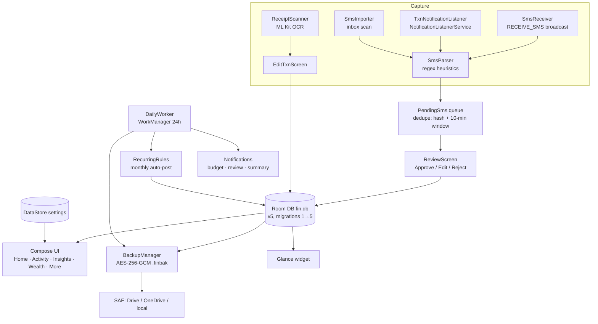
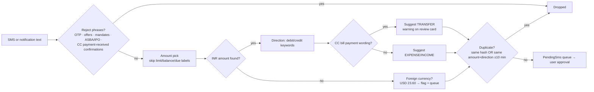

# Kosh — Design Document

Kosh (कोश, "treasury") is a **privacy-first, local-first personal finance app for Android**. This document describes the architecture, data model, feature flows, and the reasoning behind the key decisions.

---

## 1. Core principles

1. **No server, ever.** All data lives in a local Room/SQLite database in app-private storage. The APK ships **without the INTERNET permission** (stripped even when libraries request it), so the app *cannot* transmit data.
2. **User approves everything.** No detected transaction is recorded without an explicit Approve tap.
3. **Encrypted before it leaves.** Any file that exits the app (backups) is AES-256-GCM encrypted with a user passphrase first. CSV export is the single, deliberate plaintext exception with a user warning.
4. **Deterministic intelligence.** Search, digests, and categorization are rule-based and explainable. On-device ML (OCR today, Gemini Nano later) is opt-in and additive, never load-bearing.
5. **Progressive enhancement.** Every capability degrades gracefully: no SMS permission → notification capture; no biometrics → no lock-out; no AICore → deterministic features only.

## 2. Architecture

- **Single-module app**, manual dependency injection in `FinApp` (Application): database, repository, settings, backup manager, SMS importer — no DI framework.
- **One shared `AppViewModel`** exposes StateFlows for every table plus actions; screens are stateless consumers.
- **`FinRepository`** is the only gateway to Room DAOs.

## 3. Data model (Room, schema v5)

| Table | Purpose | Key fields |
|---|---|---|
| `categories` | Expense/income categories (20 defaults + custom) | name, emoji, color, kind |
| `transactions` | All money events | amountMinor (paise), type (EXPENSE/INCOME/TRANSFER), categoryId, merchant, note, timestamp, source (MANUAL/SMS/RECURRING/IMPORT), accountTail, smsHash, eventBudgetId, goalId |
| `pending_sms` | Detected-but-unapproved queue | sender, body, amountMinor, type, merchant, suggestedCategoryId, smsHash (unique), status, foreignCurrency |
| `budgets` | Monthly limit per category | categoryId (PK), monthlyLimitMinor |
| `assets` | Wealth holdings & liabilities | name, type (11 asset + 3 liability types), platform, isLiability, investedMinor |
| `asset_values` | Full value history per asset | assetId, valueMinor, timestamp |
| `goals` / `goal_contributions` | Savings goals + manual contributions | targetMinor, deadlineMillis / goalId, amountMinor |
| `event_budgets` | One-off budgets (trip, wedding) — expenses tag to them | plannedMinor |
| `recurring_rules` | Monthly auto-posted transactions | amountMinor, type, categoryId, dayOfMonth (1–28), lastAppliedKey |

**Money is always `Long` minor units (paise).** Net worth = Σ latest value of assets − Σ latest value of liabilities; history is carried forward per asset for trends (MoM/QoQ/YoY).

Migrations: v1→2 wealth tables · v2→3 event budgets + txn tags · v3→4 recurring rules · v4→5 `pending_sms.foreignCurrency`.

## 4. Capture pipeline

Category suggestion order: **user's own history for the merchant** (learning categorizer) → keyword table (Swiggy→Food, Netflix→Entertainment…) → uncategorized.

Two capture paths feed the same pipeline:
- **SMS path** (sideload build): `SmsReceiver` (live) + `SmsImporter` (inbox scan 1/3/12 months). Requires READ/RECEIVE_SMS — not Play-publishable.
- **Notification path** (Play-compatible): `TxnNotificationListener` reads bank-app and messaging notifications. Cannot see past notifications; history comes via inbox scan or restore.

## 5. Backup & migration

| Mechanism | Trigger | Destination | Encryption |
|---|---|---|---|
| Manual encrypted backup | user | any SAF target (Drive/OneDrive/local) | AES-256-GCM, PBKDF2-HMAC-SHA256 200k, passphrase ≥8 chars, never stored |
| Scheduled auto-export | weekly/monthly via DailyWorker + app start | user-chosen SAF folder (persisted grant) | same; passphrase stored app-private for unattended runs |
| Android Auto Backup | OS (~daily, idle+Wi-Fi) | Google Drive hidden app data | OS-managed, lockscreen-key protected |
| Device-to-device transfer | new-device setup | direct | OS-managed |
| CSV export/import | user | any | **plaintext** (warned) |

`.finbak` format: `"FINBAK1" ‖ salt(16) ‖ IV(12) ‖ AES-GCM ciphertext` of a versioned JSON snapshot (all tables + currency + capture settings). Restore replaces all data; older format versions still restore.

## 6. Security model

- App-private storage + Android FBE for data at rest; **deliberately no SQLCipher** (key would live on the same device; FBE already covers offline extraction; 2× APK size not justified — see assessment discussion in git history).
- **App lock**: BiometricPrompt (BIOMETRIC_WEAK | DEVICE_CREDENTIAL), re-locks when the app leaves foreground via ProcessLifecycleOwner. UI-level by design.
- **FLAG_SECURE** (default on): blocks screenshots/recordings/Recents thumbnails; toggle in More → Security.
- `SmsReceiver` gated by `BROADCAST_SMS` (system-only); notification listener gated by `BIND_NOTIFICATION_LISTENER_SERVICE`.
- No logging of message content anywhere.
- ML Kit's INTERNET permission is removed via `tools:node="remove"` — OCR models live in the Play services process.

## 7. Intelligence (deterministic, on-device)

- **NL transaction search** (`QueryParser`): amounts (20K/1.5L/2cr/20,000), periods (Q2 last year, months, years, this/last week/month/year), direction words, above/below, plural-insensitive matching, ranked closest-match fallback, "Searching: …" interpretation echo.
- **Learning categorizer**: last user-assigned category per merchant wins.
- **Digest cards** ("In short"): Insights (spend vs previous period, top category, largest expense, savings rate) and Wealth (net-worth delta vs month ago, biggest mover, liability share) — template sentences over exact aggregates.
- **Subscription detector**: ≥3 same merchant+amount, ~monthly cadence.
- **Receipt OCR**: ML Kit text recognition → total (prefers "grand total/payable" lines) + merchant into Add screen.
- **Planned (needs Pixel 8+/AICore)**: Gemini Nano parser fallback, semantic search, NL Q&A, narrative digests — all behind opt-in toggles with a plain-language data contract.

## 8. UI structure

Five tabs — Home (month pager + all-time, quick actions, pending banner, recent), Activity (NL search, filters, day groups), Insights (Overview + Compare MoM/QoQ/YoY), Wealth (net worth, trend, growth, holdings/liabilities), More (organize, security, capture, backup). Secondary routes: edit/split, review, categories, budgets & goals (3 tabs), recurring.

Adaptive: ≥600 dp width → NavigationRail + content capped at 720 dp. Material 3, fixed emerald palette, light/dark.

## 9. Build & release

- Kotlin 2.1 + Compose (M3), Room/KSP, DataStore, WorkManager, Glance, kotlinx-serialization, ML Kit text recognition (unbundled). compileSdk/target 36, minSdk 26.
- `./gradlew assembleRelease` → R8-minified ~3.6 MB APK. Release signing reads `keystore.properties` (untracked); falls back to debug key for local builds.
- **Play Store plan**: `play` flavor without SMS permissions (notification capture only); full SMS build distributed via GitHub Releases. READ_SMS has no Play exception for finance apps.
- Trademark note: "Kosh" collides with existing fintech names — verify IP-India classes 9/36 before store listing.
